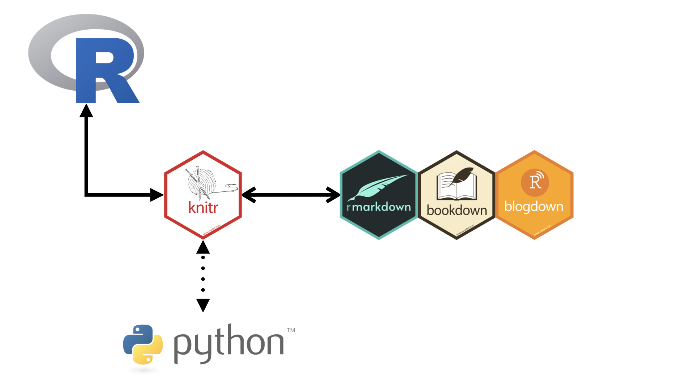
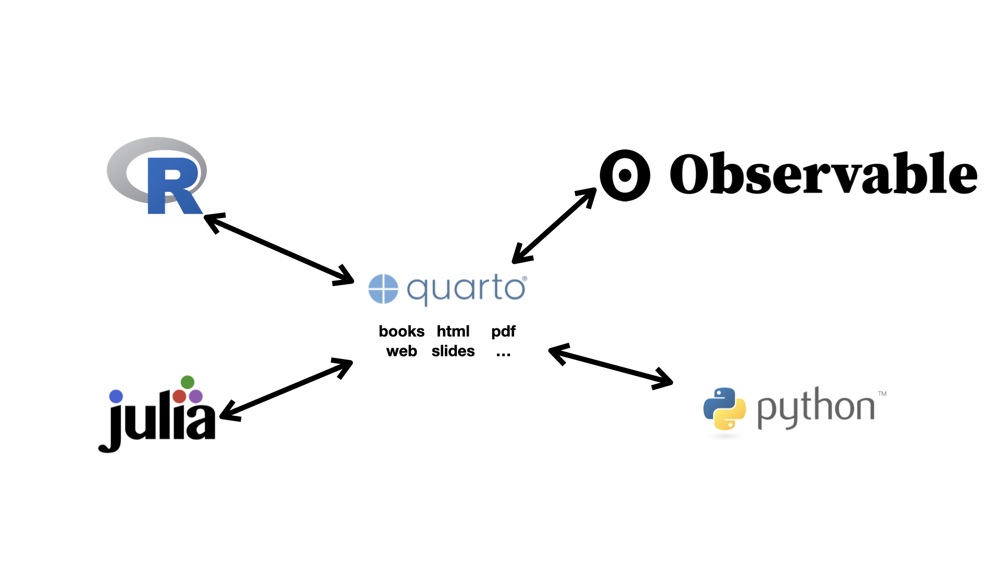
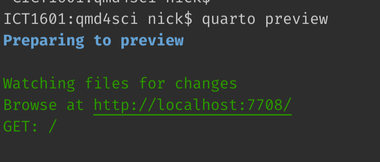

I've recently started transitioning my online book, [rmarkdown for scientists](https://rmd4sci.njtierney.com/) from [rmarkdown](https://github.com/rstudio/rmarkdown)/[bookdown](https://github.com/rstudio/bookdown) to the new [quarto](https://quarto.org/). This will be a new book, called (perhaps not the most original name), ["quarto for scientists"](https://github.com/njtierney/qmd4sci). [Alison Hill](https://www.apreshill.com/about/) recently wrote a great post, ["We don't talk about quarto"](https://www.apreshill.com/blog/2022-04-we-dont-talk-about-quarto/) that led me to see the benefits, and also that this will be the new thing we will be using in the future.

# What is quarto? Why should I care?

Alison already covers this well in her post, and you should read that instead. But, somewhat briefly, here is my summary of quarto, and why you might care about it.

Quarto is a way to write literate programming documents. These are where you combine text and code together into a single document. Sound familiar? Well, yes, it is indeed like rmarkdown. Perhaps it might be easiest to look for comparisons with how they advertise themselves.

The [README for rmarkdown](https://github.com/rstudio/rmarkdown#rmarkdown-) states:

> The rmarkdown package helps you create dynamic analysis documents that combine code, rendered output (such as figures), and prose. You bring your data, code, and ideas, and R Markdown renders your content into a polished document that can be used to:
>
> -   Do data science interactively within the RStudio IDE,
> -   Reproduce your analyses,
> -   Collaborate and share code with others, and
> -   Communicate your results with others.
>
> R Markdown documents can be rendered to many output formats including HTML documents, PDFs, Word files, slideshows, and more, allowing you to focus on the content while R Markdown takes care of your presentation.

How is this different to quarto? Well, [the README for quarto](https://github.com/quarto-dev/quarto-cli#quarto) says:

> Quarto is an open-source scientific and technical publishing system built on [Pandoc](https://pandoc.org/). Quarto documents are authored using [markdown](https://en.wikipedia.org/wiki/Markdown), an easy to write plain text format.
>
> In addition to the core capabilities of Pandoc, Quarto includes:
>
> 1.  Embedding code and output from Python, R, and JavaScript via integration with [Jupyter](https://jupyter.org/), [Knitr](https://yihui.org/knitr/), and [Observable](https://github.com/observablehq/).
>
> 2.  A variety of extensions to Pandoc markdown useful for technical writing including cross-references, sub-figures, layout panels, hoverable citations and footnotes, callouts, and more.
>
> 3.  A project system for rendering groups of documents at once, sharing options across documents, and producing aggregate output like [websites](https://quarto.org/docs/websites/) and [books](https://quarto.org/docs/books/).
>
> 4.  Authoring using a wide variety of editors and notebooks including [JupyterLab](https://quarto.org/docs/tools/jupyter-lab.html), [RStudio](https://quarto.org/docs/tools/rstudio.html), and [VS Code](https://quarto.org/docs/tools/vscode.html).
>
> 5.  A [visual markdown editor](https://quarto.org/docs/visual-editor/) that provides a productive writing interface for composing long-form documents.
>
> Learn more about Quarto at <https://quarto.org>.

## OK, but what does that mean?

Here's the way I see it. rmarkdown is awesome, and it isn't going anywhere. rmarkdown has been able to produce documents that use other software, such as python, bash, stan and many more. However, there are a few points of friction:

1.  You need to call it from R to use it. No problem for R users, but what if you use python? Or javascript? If you are a python user, using R to use python just might not be in your workflow.
2.  There are great packages that provide extensions, such as `blogdown` for blogs, `bookdown` for books, and `xaringan` for slides. However, there are differences between these systems that might cause stumbles. Each of these systems is an iteration towards something awesome, and it's only natural they might be a little bit different.

quarto, instead of being an R package, is a separate piece of software, that you can call from the command line (terminal). This means other pieces of software can use it to create their own literate programming documents. Well, that's my understanding.

Here are some not-particularly-well-drawn diagrams to illustrate this point.

In rmarkdown, we are working in rmarkdown, and that uses knitr to talk to R and handle the document generation:

But with quarto, we have this general interface, where quarto can talk to different programming languages. Not pictured, but the "R engine" is in fact, `knitr`:

# OK, but why should I care?

Well, you might not need to! I cannot imagine rmarkdown going away any time soon. So, you definitely don't *need* to change.

That being said. From what I can tell, quarto appears to be a lot more consistent. For example, instead of having a special [`_bookdown.yml` file](https://github.com/njtierney/rmd4sci/blob/master/_bookdown.yml) for your bookdown, which also needs a special [\_output.yml](https://github.com/njtierney/rmd4sci/blob/master/_output.yml) file, there is just now one single [\_quarto.yml](https://github.com/njtierney/qmd4sci/blob/master/_quarto.yml) file. It also means that there will likely be less pain if you need to change from a book to a website, to slides, to something else. So, I care because I like using the latest technology, and this seems like it will in the long run, be something that will be widely used. But I also work as a research software engineer, and caring about the latest and greatest tech is something that is on brand with the job. You don't need to change to quarto. But it looks pretty cool.

# Moving from rmarkdown to quarto

Here are the rough steps I went through for going from rmarkdown to quarto

### installing quarto + latest rstudio

I followed the instructions here to install quarto: <https://quarto.org/docs/get-started/>

As of 2022-04-08, it seems best to install the daily build of RStudio, which I did here: <https://dailies.rstudio.com/>

### change filenames: filename.Rmd ---\> filename.qmd

I used this code to identify the files that ended with ".Rmd" and then renamed them to end with ".qmd", which is the quarto extension.

<pre class='chroma'><code class='language-r' data-lang='r'><a href='https://rdrr.io/r/base/library.html'>library</a>(<a href='https://fs.r-lib.org'>fs</a>)
<a href='https://rdrr.io/r/base/library.html'>library</a>(<a href='http://stringr.tidyverse.org'>stringr</a>)
rmd_names &lt;- <a href='https://fs.r-lib.org/reference/dir_ls.html'>dir_ls</a>(path = ".", glob = "*.Rmd")
qmd_names &lt;- <a href='https://stringr.tidyverse.org/reference/str_replace.html'>str_replace</a>(string = rmd_names,
                         pattern = "Rmd",
                         replacement = "qmd")
<a href='https://fs.r-lib.org/reference/file_move.html'>file_move</a>(path = rmd_names,
          new_path = qmd_names)

<a href='https://fs.r-lib.org/reference/file_move.html'>file_move</a>(path = "_bookdown.yml",
          new_path = "_quarto.yml")
</code></pre>

You can see this change in [this commit of qmd4sci](https://github.com/njtierney/qmd4sci/commit/46da24051b42c092963c19c718a34596ba58e769).

### Change `_bookdown.yml` to `_quarto.yml` and remove `_output.yml`

I also needed to change most of the structure of `_bookdown.yml`, and to do so I followed the guidance of the [book](https://quarto.org/docs/books/) guide in quarto, as well as looking at two quarto books they have provided, ["Hands on Programming with R"](https://github.com/jjallaire/hopr), and ["Data Visualization Curriculum"](https://github.com/uwdata/visualization-curriculum).

One thing I also needed to do was to replace the chapter names I had listed in the chapter as :

-   "index.Rmd" --\> "index.qmd"

-   "license.Rmd" -\> "license.qmd"

et cetera.

I used this code to do that:

<pre class='chroma'><code class='language-r' data-lang='r'><a href='https://rdrr.io/r/base/library.html'>library</a>(<a href='https://readr.tidyverse.org'>readr</a>)
<a href='https://rdrr.io/r/base/library.html'>library</a>(<a href='http://stringr.tidyverse.org'>stringr</a>)
quarto_yaml_rmd &lt;- <a href='https://readr.tidyverse.org/reference/read_lines.html'>read_lines</a>("_quarto.yml")

quarto_yaml_qmd &lt;- <a href='https://stringr.tidyverse.org/reference/str_replace.html'>str_replace_all</a>(string = quarto_yaml_rmd,
                                   pattern = "Rmd",
                                   replacement = "qmd")

<a href='https://readr.tidyverse.org/reference/read_lines.html'>write_lines</a>(
  x = quarto_yaml_qmd,
  file = "_quarto.yml"
)
</code></pre>

Which you can see in [this commit](https://github.com/njtierney/qmd4sci/commit/aa9f1e8df8795776d9a055c663ff332f24c5f069).

### build? preview?

I then tried to click the nifty, "build" tab that appears in the environment pane in RStudio. But this didn't work. So I turned to the terminal and typed:

    quarto preview

And then I got some errors.

Specifically,

    qmd4sci nick$ quarto preview
    Preparing to preview
    [ 1/23] index.qmd
    ERROR: Validation of YAML front matter failed.
    ERROR: In file index.qmd
    (line 11, columns 13--15) Key colorlinks has value yes, which must be `true` or `false`

    ✖ The value yes is a string.
    ℹ The error happened in location colorlinks.
    ℹ Quarto uses YAML 1.2, which interprets booleans strictly.
    ℹ Try using true instead.

Which is actually quite helpful!

This tells me that I need to look at the `index.qmd` file, which had a bunch of YAML metadata in it like so:

    --- 
    title: "RMarkdown for Scientists"
    author: "Nicholas Tierney"
    date: "2022-04-11"
    knit: "bookdown::render_book"
    description: "A book created for a 3 hour workshop on rmarkdown"
    documentclass: krantz
    site: bookdown::bookdown_site
    bibliography: [book.bib, packages.bib]
    biblio-style: apalike
    colorlinks: yes
    fontsize: 12pt
    monofont: "Source Code Pro"
    monofontoptions: "Scale=0.7"
    link-citations: yes
    url: 'https\://rmd4sci.njtierney.com/'
    ---

It turns out I could remove this, and put most of it into the `_quarto.yml` file. I think this is a nice example of how quarto can help simplify things. It used to be a thing that you had to have some file that gave some extra metadata, or at least, it seemed like the best thing to do at the time that I wrote that book. But now all of that stuff goes into `_quarto.yml`.

(Also, really cool thing about using the latest RStudio daily build that I noticed, is that you get tab-completion when you are inside the YAML. So you can start exploring options for things to add! Neat. But perhaps that was already a feature in regular-rstudio and I didn't notice.)

Anyway, these changes are detailed in [this commit](this%20commit).

### repeat: build? preview?

The `build` tab doesn't seem to work for me in RStudio, since it seems to call `rmarkdown` by default and that doesn't really work.

Typing `quarto preview` into my terminal I get something like this:

Rather neatly, quarto appears to re render whenever I save files, which is pretty awesome!

## What next?

I'll need to update the book to change references from rmarkdown to quarto, as well as change all the details of rmarkdown to quarto, and all the new quarto features. Which is, well, probably a lot.

# Learning more

-   [The quarto documentation](https://quarto.org/)

-   [Alison Hill](https://www.apreshill.com/about/)'s blog post, ["We don't talk about quarto"](https://www.apreshill.com/blog/2022-04-we-dont-talk-about-quarto/)

-   [Mine Çetinkaya-Rundel's presentation, "Reproducible authoring with Quarto", at the Toronto R Workshop](https://www.youtube.com/watch?v=6p4vOKS6Xls)

